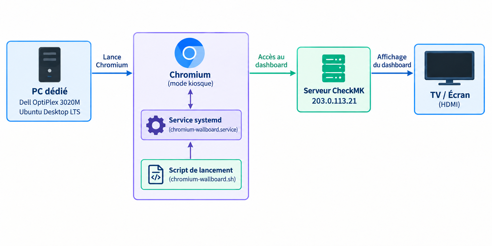

# 📄 Procédure Technique : Déploiement et Maintenance du Wallboard CheckMK

**Environnement :** Ubuntu Desktop 24.04 LTS (`wallboard-desk`, IP : `203.0.113.38`)

> ℹ️ Les adresses IP de ce document sont anonymisées (plage RFC 5737 — `203.0.113.0/24`) et ne correspondent pas aux valeurs réelles de l'infrastructure.

---

## 1. Présentation générale

Ce document décrit l'architecture technique du wallboard de supervision CheckMK. Le système démarre de manière entièrement autonome, contourne l'authentification interactive, et maintient l'affichage du tableau de bord en mode kiosque plein écran de façon résiliente.


---

## 2. Préparation de la machine

### 2.1 Clé USB bootable

Créée avec **Rufus**, depuis un PC Windows : sélection de l'ISO Ubuntu Desktop 24.04, schéma de partition GPT, système de destination UEFI (non CSM).

### 2.2 Effacement du disque

Le poste étant destiné à être réaffecté, un effacement du disque a été réalisé avant installation. Démarrage sur la clé USB en mode **« Essayer Ubuntu »** (environnement live, sans rien installer), puis depuis un terminal ouvert dans cet environnement :

```bash
lsblk
sudo wipefs -a /dev/sda
```

⚠️ Cet effacement ne peut pas se faire depuis un système actuellement démarré sur ce même disque il faut d'abord booter sur un support externe.

### 2.3 Installation d'Ubuntu Desktop

Installation standard, avec un point de vigilance : cocher **« Se connecter automatiquement »** à la création du compte, condition nécessaire à l'autologin.

---

## 3. Architecture et Fonctionnement

L'architecture repose sur trois piliers système :

1. **GDM3 (X11) :** Connexion automatique (*autologin*) de la session du compte `checkmk-kiosk`, sans aucune intervention humaine requise.
2. **Service Systemd Utilisateur :** Supervision native du navigateur, garantissant la relance automatique en cas de plantage et la protection des ressources RAM.
3. **Chromium Kiosk :** Affichage plein écran épuré (sans barres d'outils) pointé sur le serveur CheckMK.

---

## 4. Certificat racine d'entreprise

Le pare-feu de l'organisation effectue une inspection SSL (interception TLS) sur le trafic sortant, ce qui bloque par défaut les installations passant par HTTPS (notamment le Snap Store, nécessaire à l'installation de Chromium). Sans le certificat racine de l'entreprise, l'installation échoue avec :

```
error: cannot install "chromium": Post "https://api.snapcraft.io/v2/snaps/refresh": tls:
       failed to verify certificate: x509: certificate signed by unknown authority
```

**Résolution :**

```bash
sudo cp certificate.crt /usr/local/share/ca-certificates/rootca.crt
sudo update-ca-certificates
sudo systemctl restart snapd
```

> 💡 Le redémarrage de `snapd` est l'étape souvent oubliée : `update-ca-certificates` met à jour la liste système, mais le service déjà démarré garde l'ancienne liste en mémoire tant qu'il n'est pas relancé.

```bash
sudo snap install chromium
```

---

## 5. Configuration pas à pas

### 5.1. Configuration de l'Autologin et de X11 (GDM3)
Le fichier `/etc/gdm3/custom.conf` est configuré de la manière suivante pour éviter les invites de trousseau de clés interactives liées à Wayland :

```ini
[daemon]
AutomaticLoginEnable = true
AutomaticLogin = checkmk-kiosk
WaylandEnable = false
```

### 5.2. Script de lancement (`~/chromium-wallboard.sh`)
Placé dans le répertoire personnel de l'utilisateur `checkmk-kiosk` :

```bash
#!/bin/bash
exec chromium --kiosk --no-first-run --disable-infobars http://203.0.113.21/monitoring
```
*(L'utilisation de la commande `exec` permet de remplacer le processus du shell par celui du navigateur pour une gestion propre par systemd).*

### 5.3. Service Systemd Utilisateur (`~/.config/systemd/user/chromium-wallboard.service`)
Le service Systemd permet de lancer et de surveiller automatiquement Chromium dans la session graphique de l'utilisateur.

```ini
[Unit]
Description=Chromium Kiosk Wallboard
After=graphical-session.target

[Service]
ExecStart=%h/chromium-wallboard.sh
Restart=always
RestartSec=5
MemoryMax=1.5G

[Install]
WantedBy=graphical-session.target
```
> **Note :**
> 
> - **`Description`** : donne un nom au service.
> - **`After=graphical-session.target`** : attend que la session graphique soit démarrée avant de lancer Chromium.
> - **`ExecStart`** : lance le script `chromium-wallboard.sh`, qui démarre Chromium en mode kiosque.
> - **`Restart=always`** : relance automatiquement Chromium s'il se ferme ou plante.
> - **`RestartSec=5`** : attend 5 secondes avant de relancer Chromium.
> - **`MemoryMax=1.5G`** : limite la mémoire utilisée par le service à 1,5 Go.
> - **`WantedBy=graphical-session.target`** : permet au service de démarrer automatiquement avec la session graphique.

Commandes d'activation du service :
```bash
systemctl --user daemon-reload
systemctl --user enable chromium-wallboard.service
```

### 5.4. Connexion persistante au compte de supervision

Plutôt que de préremplir un formulaire de connexion (méthode retirée des versions récentes de CheckMK pour des raisons de sécurité), une connexion manuelle unique est effectuée sur le compte dédié. La session reste active durablement Chromium ne tournant pas en navigation privée, son profil est conservé entre les redémarrages.

---

## 6. Passage en IP fixe

```bash
sudo nmcli connection modify <nom-connexion> \
  ipv4.addresses 203.0.113.38/16 \
  ipv4.gateway 203.0.113.254 \
  ipv4.dns 203.0.113.254 \
  ipv4.method manual
sudo nmcli connection up <nom-connexion>
```

**Point de vigilance :** après bascule DHCP → IP fixe, l'ancienne adresse DHCP peut rester active en parallèle (`inet ... secondary dynamic`), créant une ambiguïté réseau. Nettoyage :
```bash
sudo ip addr del <ancienne-ip>/16 dev <interface>
```

---

## 7. Compte de supervision dédié

Un compte CheckMK dédié (`kiosque`) a été créé avec un rôle en **lecture seule** pas de droits d'administration, pour un poste affiché en continu dans un lieu de passage. Le délai d'inactivité de session est désactivé **uniquement pour ce compte** (réglage disponible par utilisateur dans CheckMK), sans toucher au délai global appliqué aux autres comptes.

---

## 8. Résilience et Sécurité

* **Matériel :** Redémarrage automatique activé dans le BIOS (AC Power Recovery).
* **Processus :** Supervision native via systemd (`Restart=always`), garantissant une relance immédiate et fiable en cas d'arrêt du navigateur.
* **Mémoire :** Limitation stricte de la RAM allouée via `MemoryMax=1.5G`, en prévention de toute dérive mémoire sur le long terme.
* **Compte dédié :** Utilisateur `kiosque` restreint aux droits de lecture seule sur CheckMK.


---

## 9. Recette finale

- [x] Démarrage entièrement autonome, sans intervention
- [x] Affichage plein écran du dashboard, sans éléments d'interface visibles
- [x] Reprise automatique après coupure d'alimentation (AC Recovery)
- [x] Relance automatique en cas de plantage du navigateur (service systemd, `Restart=always`)
- [x] Accès SSH fonctionnel pour la maintenance à distance
- [x] Compte de supervision à droits limités, session persistante
