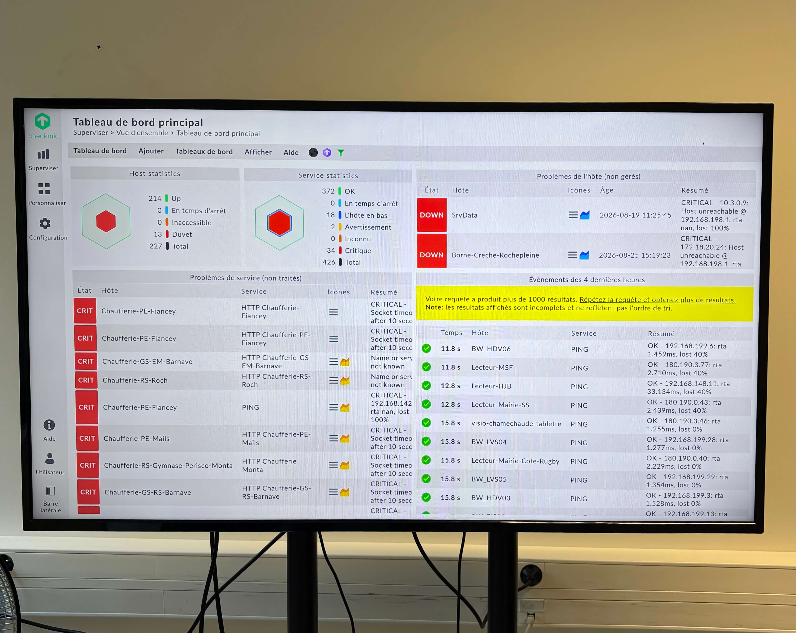

# 🖥️ Wallboard de Supervision CheckMK (Dell OptiPlex / Ubuntu 24.04 LTS)

Documentation technique et fichiers de configuration d'un wallboard de supervision : un écran mural affichant en continu, de façon totalement autonome, l'état de la supervision réseau via le logiciel de monitoring CheckMK.

> ℹ️ Les adresses IP présentées dans ce dépôt sont anonymisées (plage RFC 5737 — `203.0.113.0/24`) et ne correspondent pas aux valeurs réelles de l'infrastructure de production.

---

##  Présentation du Projet

* **Objectif :** Afficher en continu et de manière autonome l'état de supervision des équipements réseau sur un écran mural.
* **Matériel :** PC Dell OptiPlex (Nom d'hôte : `wallboard-desk`, IP : `203.0.113.38`).
* **Système d'exploitation :** Ubuntu Desktop 24.04 LTS.
* **Architecture :** Autologin GDM3 sur session X11, supervisé par un service utilisateur systemd garantissant la disponibilité continue du navigateur en mode kiosque.

### Cahier des charges

- Affichage continu du dashboard CheckMK, sans intervention quotidienne
- Redémarrage et reprise autonomes après coupure de courant ou plantage
- Mode kiosque strict : plein écran, sans éléments d'interface
- Accès SSH pour la maintenance à distance
- Système d'exploitation : Ubuntu Desktop LTS, pour rester distinct du serveur CheckMK existant (lui-même sous Ubuntu Server)

---

##  Stack Technique

- **Gestionnaire de connexion :** GDM3 configuré avec `AutomaticLogin` sur une session **X11** (plutôt que Wayland), choix retenu pour fiabiliser l'autologin et éviter les invites de trousseau de clés interactives.
- **Supervision des processus :** Service utilisateur systemd (`chromium-wallboard.service`), avec relance automatique (`Restart=always`) et une limite stricte de consommation mémoire (`MemoryMax=1.5G`) — une supervision native du processus, plus robuste qu'un script de surveillance externe, et qui protège la machine de toute dérive mémoire sur le long terme.
- **Navigateur Kiosk :** Chromium exécuté en mode plein écran autonome (`--kiosk`, `--no-first-run`, `--disable-infobars`) pointé vers le serveur de supervision local.
- **Compte de supervision :** Compte CheckMK dédié, en lecture seule, session maintenue active durablement.

---

## 📂 Structure du Dépôt

```text
├── README.md               # Présentation du projet et architecture
├── procedure.md            # Guide technique et de dépannage complet
├── scripts/
│   └── chromium-wallboard.sh           # Script principal de lancement du navigateur
└── systemd/
    └── chromium-wallboard.service      # Fichier de service utilisateur systemd
```

---

##  Guide de Déploiement Rapide

1. **Copier les fichiers** sur la machine cible dans le répertoire de l'utilisateur `checkmk-kiosk`.
2. **Configurer l'authentification automatique** dans `/etc/gdm3/custom.conf`.
3. **Activer le service Systemd utilisateur :**
   ```bash
   systemctl --user enable chromium-wallboard.service
   systemctl --user start chromium-wallboard.service
   ```
4. **Redémarrer le poste** pour valider le démarrage à froid et l'affichage automatique du kiosque.

*Pour consulter la procédure détaillée pas à pas, référez-vous au fichier [procedure.md](./PROCEDURE.md).*

---

##  Points techniques notables

- **Certificat racine d'entreprise :** le pare-feu effectuant une inspection SSL sur le trafic sortant, l'installation de Chromium (via le Snap Store) nécessite l'import préalable du certificat racine de l'organisation dans le magasin de confiance système.
- **IP fixe :** configuration réseau statique via `nmcli`, en coordination avec l'administration réseau, pour garantir une adresse stable au fil des redémarrages.
- **Compte de supervision dédié :** droits limités à la lecture seule, avec délai d'inactivité désactivé spécifiquement pour ce compte (sans impact sur les autres utilisateurs CheckMK).

##  Résultat


